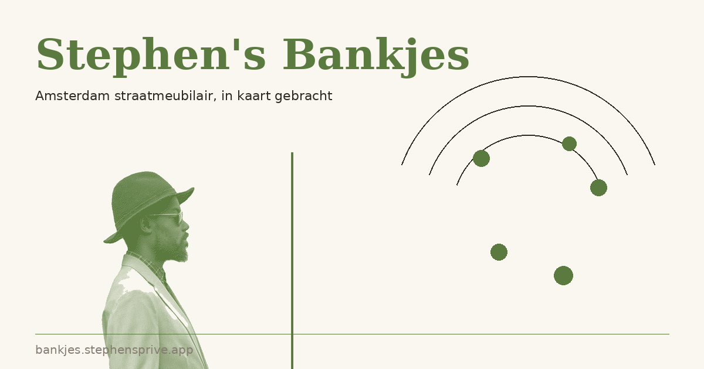

# Stephen's Bankjes

> Een Amsterdam straatmeubilair-explorer. Officiële BGT-data van de
> gemeente naast OpenStreetMap, met Mapillary-foto's per locatie en
> "wat staat er in de buurt"-lijst.

**Live**: [bankjes.stephenadei.nl](https://bankjes.stephenadei.nl)
**Onderzoek**: [bankjes.stephenadei.nl/onderzoek](https://bankjes.stephenadei.nl/onderzoek) — de BGT vs OSM coverage-analyse die dit project gestart heeft



## Wat is dit

In Amsterdam staan **345 banken** in het BGT-register van de gemeente.
OpenStreetMap kent er **6.961**. Tussen die twee zit een ongemakkelijke
discrepantie: het officiële register dekt vooral Weesp (sinds 2022 deel
van Amsterdam), terwijl OSM het centrum vol heeft staan dankzij jaren
crowd-sourcing.

Bankjes laat beide bronnen op één kaart zien, gededupliceerd op
10m-proximity zodat fysieke banken maar één keer geteld worden. Tap
een bank → adres, foto's van de plek via Mapillary, "↗ Street View" /
"↗ Open in Maps" links.

Het project begon als hobby tijdens een minor programmeren aan de UvA;
het concept bleef daarna in het curriculum maar de uitvoering niet.
Dit is die uitvoering.

## Stack

| Component | Tech |
|---|---|
| Backend | FastAPI · httpx · cachetools |
| Frontend | Vanilla JS · Leaflet · Leaflet.markercluster |
| Sources | DSO (`api.data.amsterdam.nl/v1`), OSM Overpass, Mapillary Graph API |
| Hosting | Docker · nginx · Cloudflare (proxy + origin certs) |
| Tests | pytest + `httpx.MockTransport` |

Geen database. Alles in-memory met TTL-cache; benches verplaatsen
zelden genoeg om een DB te rechtvaardigen.

## Lokaal draaien

```bash
cp .env.example .env
# Vul AMSTERDAM_API_KEY in (https://keys.api.data.amsterdam.nl/clients/v1/)
# Mapillary-token is optioneel (foto-blok in popup verdwijnt zonder)

docker compose up --build
# Open http://localhost:4309
```

Of zonder Docker:

```bash
pip install -r requirements.txt
uvicorn app.main:app --reload
# Open http://localhost:8000
```

## Endpoints

- `GET /` — Leaflet UI
- `GET /onderzoek` — gap-analyse pagina met live coverage-cijfers
- `GET /healthz` — liveness check
- `GET /api/datasets` — frontend's single source of truth voor categorieën
- `GET /api/items` — alle markers
- `GET /api/items?dataset=bench` — één categorie
- `GET /api/items?bbox=south,west,north,east` — alleen binnen viewport
- `GET /api/coverage` — BGT/OSM/merged tellingen voor de gap-analyse
- `GET /api/photos?lat=&lon=&radius=&limit=` — Mapillary straat-foto's bij coords

## Ontwerp-narratief

De interessante technische keuze zit in **ADR-0001** (`docs/adr/`):
hoe je twee registers die hetzelfde object soms dubbel beschrijven in
één UI-categorie krijgt zonder een ervan stilletjes te dumpen. Korte
versie: composite-source-pattern, BGT-wins-bij-collision op 10m
proximity, OSM-only markers blijven staan waar BGT geen coverage heeft.
De `/onderzoek`-page legt het visueel uit.

## Licentie

[MIT](LICENSE) — gebruik 't, fork 't, maak je eigen variant voor jouw
stad. Het frame past op elke gemeente met open BGT-data.
